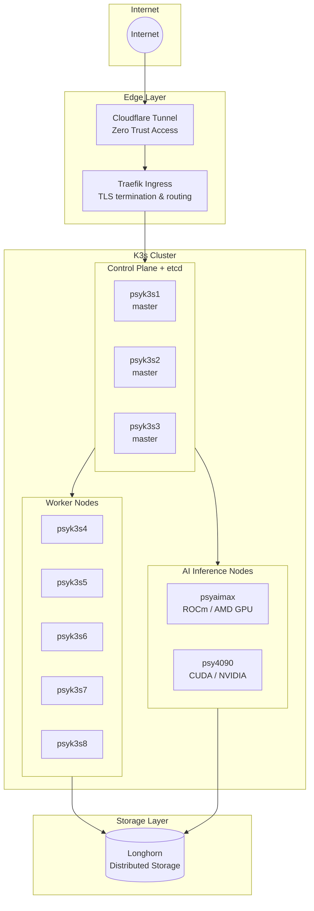
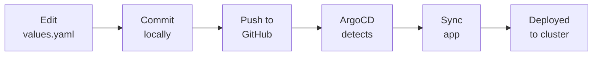

# Architecture Overview

The homelab is designed around a few core principles:

1. **GitOps-first** - All configuration lives in Git, ArgoCD deploys everything
2. **High availability** - Critical services run replicated across nodes
3. **Resource efficiency** - ARM-based nodes keep power consumption low
4. **Separation of concerns** - Dedicated nodes for specialized workloads

## Network Topology

## Node Roles

Each node has a specific purpose, controlled through Kubernetes taints and tolerations:

| Node | Role | Taint |
|------|------|-------|
| **psyk3s1** | Omada Controller | `network-controller-host=true:NoSchedule` |
| **psyk3s2** | Unifi Controller | `network-controller-host=true:NoSchedule` |
| **psyk3s3** | Semaphore (Ansible UI) | `node-management=true:NoSchedule` |
| **psyk3s4-8** | General workloads | None |
| **psyaimax** | ROCm AI inference | `rocm-inference=true:NoSchedule` |
| **psy4090** | CUDA AI inference | `cuda-inference=true:NoSchedule` |

## Storage Architecture

Longhorn provides distributed block storage with:

- **3x replication** for critical data
- **NVMe-backed** storage on each Pi
- **Automatic snapshots** and backup to S3
- **RWO volumes** for most workloads

## GitOps Flow

